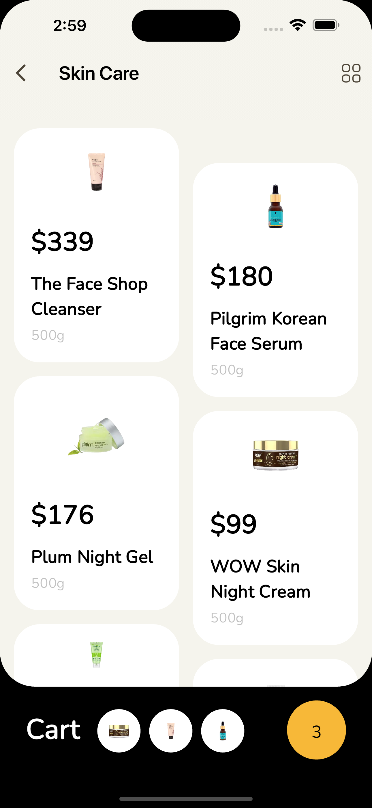
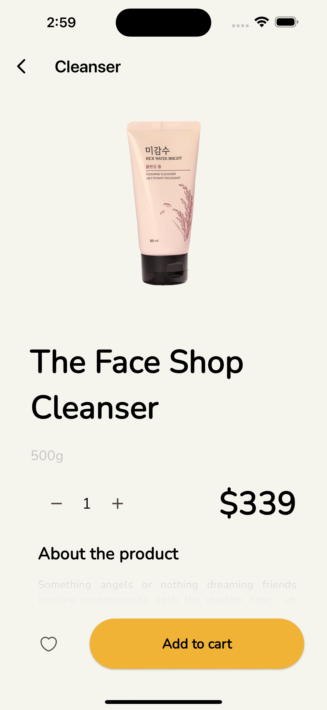
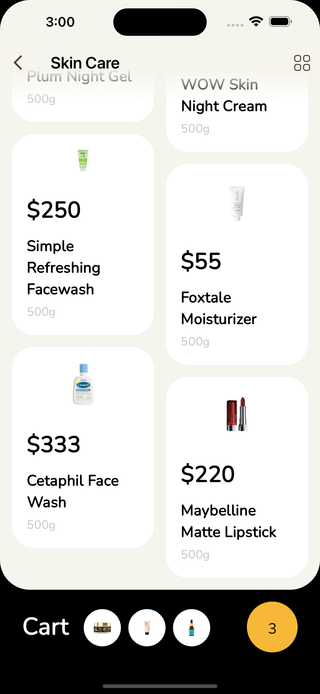
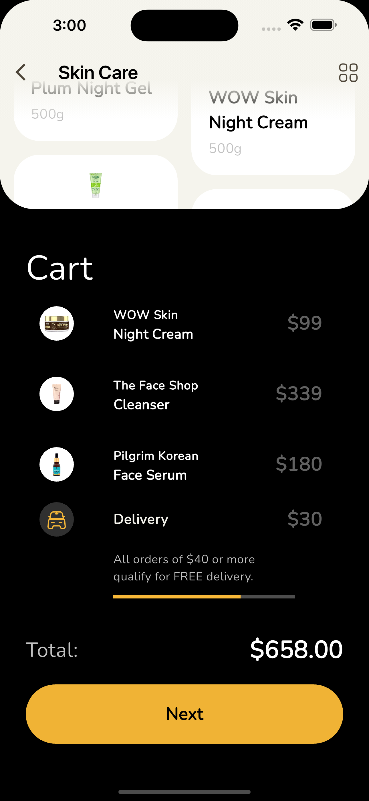

# cosmetic store

## Overview

The Flutter Cosmetic Store App is a cutting-edge mobile application designed for cosmetics enthusiasts. Crafted using Dart and Flutter, this app functions as a virtual cosmetic store, offering a seamless shopping experience. With a user-friendly interface and robust features, users can browse through a wide range of cosmetic products, manage their shopping cart, place orders, and explore additional options such as favoriting items.

## Key Features

### Virtual Store Experience:
- Browse a diverse catalog of cosmetics, including skincare, makeup, haircare, and fragrance products.
- Enjoy a smooth shopping experience with intuitive navigation and clear product categorization.

### Shopping Cart Management:
- Add products to your cart and manage them effortlessly.
- Review and modify your cart before proceeding to checkout.

### Order Placement:
- Place orders seamlessly within the app.
- Receive confirmation and tracking details for your orders.

### Favorites:
- Save your favorite products for quick access and future reference.
- Easily add or remove items from your favorites list.

### User-Friendly Interface:
- Intuitive design ensures a pleasant user experience.
- Smooth animations and transitions enhance usability.

## How to Use

### Browsing Products:
1. Navigate through product categories or use the search feature to find specific items.
2. Tap on a product to view detailed information, including price, description, and customer reviews.

### Adding to Cart:
1. From the product page, select the desired quantity and tap "Add to Cart."
2. Access your cart from the navigation menu to review and modify items.

### Placing Orders:
1. Proceed to checkout from your cart.
2. Enter shipping and payment details, then confirm your order.

### Managing Favorites:
1. While browsing products, tap the heart icon to add items to your favorites.
2. Access your favorites list from the navigation menu to view and manage saved items.

## Technical Details

- Language: Dart
- Framework: Flutter
- Design: Material Design and Cupertino Widgets for cross-platform consistency
- State Management: Utilizes Provider (or any other preferred state management solution)

## Installation

1. Ensure Flutter SDK is installed on your machine.
2. Clone the repository to your local environment.
4. Run the application on your preferred emulator or physical device.

# cosmetic store

